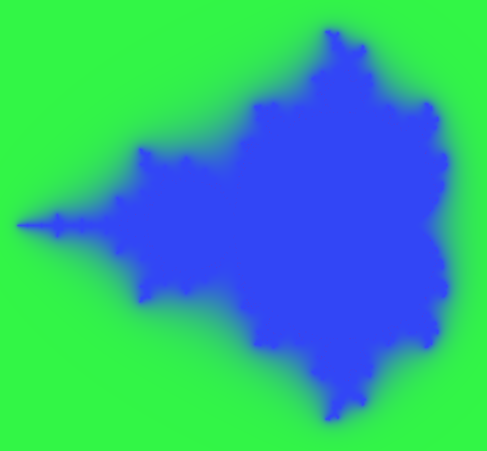

Formalised Mandelbrot renders
=============================

[](https://github.com/girving/ray-render/actions/workflows/lean.yml)

We build on [verified interval arithmetic](https://github.com/girving/interval) and
[verified holomorphic dynamics results](https://github.com/girving/ray) for verified
rendering of the Mandelbrot set and its potential function. For now, all we have is
potential function renders such as

<p align="center">
  
</p>

The semantics of this render are that the color of each pixel is off by at most
one in each coordinate, except for red pixels which can have arbitrary error.
And there are only a few of those!

## Area estimates

We also use the Koebe quarter theorem for verified upper bounds on the area of
the Mandelbrot set, following Fisher and Hill 1993. With `d = 12` we get

$$\mu(M) \le 239397p-17 \approx 1.826454$$

in 99 minutes. This is of course very far from SOTA: Fisher and Hill get 1.57012937,
and [Thorsten Förstemann](https://www.foerstemann.name/labor/area/Mset_area_TE_2017.pdf)
used similar methods to depth 26 to get $\mu(M) \le 1.53121$ in 550 hours.

## Building

1. Install [`elan`](https://github.com/leanprover/elan) (`brew install elan-init` on Mac)
2. `lake build`

## Optimization and debugging tricks

I'm going to keep a list here, since otherwise I will forget them.

```
-- Tracing options
set_option trace.aesop true in

-- Print compiler IR, such as to see how well inlining worked:
set_option trace.compiler.ir.result true in
def ...
```
